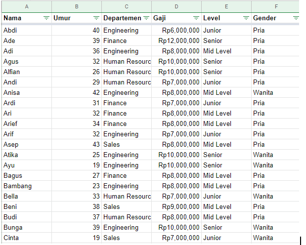
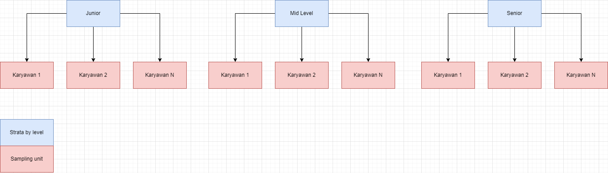
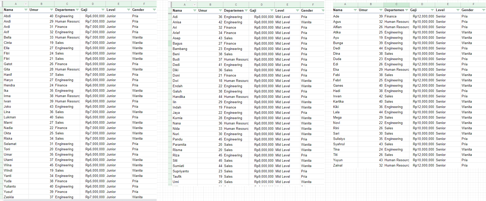
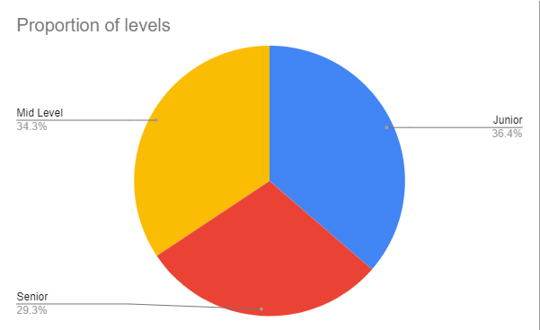
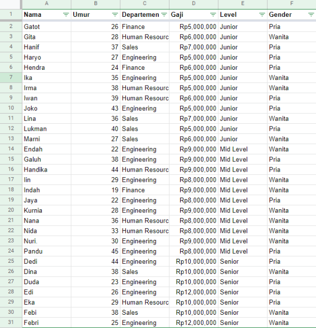
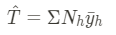
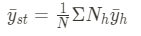

# Introduction

Rancangan sampling yang saya lakukan adalah dari data karyawan layoff di tech company Indonesia akibat “Tech Winter” yang terjadi belakangan ini.
Alasan saya memilih topik ini adalah, untuk mencari tahu rata-rata penghematan yang terjadi didalam perusahaan dan juga estimasi total penghematan yang terjadi.
Supaya kita tahu, berapa lama perusahaan bisa bertahan akibat penghematan yang telah dilakukan

---

# Goals

Kita ingin mengetahui berapa banyak rata-rata penghematan yang terjadi didalam perusahaan dan juga estimasi total penghematan yang terjadi.
Manfaatnya, kita bisa mengetahui apakah perusahaan mampu bertahan dengan penghematan yang ada, atau harus layoff lagi untuk bertahan selama setahun dan dua tahun kedepan.

---

# Rancangan Sampling

### Populasi

Seluruh karyawan tech company

### Populasi Target

Karyawan tech company yang terkena layoff

### Sampling Frame

- Karyawan wanita
- Karyawan pria
- Karyawan bergaji besar
- Karyawan bergaji kecil

### Unit Sampling

Karyawan di masing masing levels ( Junior, Mid Level, Senior )

### Unit Observasi

Karyawan tech company

### Unit Analisis

Kita ingin mengetahui berapa banyak karyawan yang di layoff oleh tech company di Indonesia dengan beberapa sample yang ada, berapa rata rata gaji dari karyawan yang dipecat, berapa total pemecatan yang terjadi, berapa total gaji dari karyawan yang dipecat.

### Karakteristik yang diteliti

Meneliti karyawan yang d layoff

### Nilai karakteristik yang diestimasi

- Tingkat persentase pemecatan
- Estimasi total pemecatan yang terjadi
- Estimasi rata-rata gaji yang dimiliki karyawan

### Metode sampling

Dikarnakan data yang saya memiliki berisikan

- Nama
- Umur
- Gaji
- Level
- Departemen

Saya akan mencoba menggunakan stratified sampling dan men-stratakan berdasarkan levelnya ( Junior, Mid Level, Senior ) dan mengambil SRS dari strata tersebut.

**Data yang saya miliki**

**Ilustrasi Metode Sampling**

### Langkah Langkah pengambilan sampel

Karna data saya kurang cocok untuk membagi strata berdasarkan gender dikarnakan ratio dari datanya tidak berbeda jauh 51% dan 49%, saya akan membagi berdasarkan level ( junior, senior, mid level )

**Tahap 1: Membagi kelompok menjadi 3 strata Junior, Senior, Mid-Level**

Ketika sudah dibagi per strata seperti data diatas kita bisa melakukan tahap 2

**Tahap 2: Ambil sample berdasarkan ratio dari proporsi dari levels**

Yaitu 34% mid level, 36% orang junior level, 29% senior level.
Kalau kita mengambil 30 jumlah sampel, berarti bisa ambil sejumlah.

**Junior: 12 orang**

**Mid Level: 11 orang**

**Senior: 7 orang**

**Tahap 3: Gunakan SRS dan ambil sample sesuai proporsi yang sudah ditentukan diatas**

### Metode pengumpulan data

Untuk meneliti persentase layoff dan pattern apa yang bisa di lihat untuk memprediksi layoff terhadap karyawan, saya harus melakukan survey online terhadap karyawan karyawan dari tech company yang terlibat.
Tekhnik ini bagus, karna sekarang lagi zamannya covid dan pandemi, sangat baik jika meng-approach target dengan online, apalagi karyawan tech company sudah memiliki akses internet yang bagus.

### Metode melakukan estimasi parameter

Estimasi total pemecatan yang terjadi

Estimasi Rata-rata gaji yang dimiliki karyawan

---

# Analisa

Rancangan sampling yang saya lakukan dengan stratified sampling terfokus pada kemudahan biaya untuk pengambilan sample dalam sumber daya yang dibutuhkan, mencari sumber daya yang bisa di sampling sangat mudah dikarnakan kita sudah membagi stratanya, jadi kita perlu mengambil sample junior, mid level dan senior dalam rasio yang sudah ditentukan.

Metode pengambilannya menggunakan survey online, sehingga sangat mudah untuk menjangkau responden.
Selain itu biayanya juga murah, karna hanya diperlukan survey online, tidak perlu turun kelapangan untuk mencari.

Keterbatasan dalam melakukan pengambilan sampling sesuai metode diatas adalah, dikarnakan menggunakan survey online, sangat mudah untuk mendapatkan sampling bias seperti non-response bias, tapi kita harus melakukan follow up terus menerus supaya bisa mendapatkan proper response dari responden.

Hasilnya sangat masuk akal, stratified sampling adalah metode yang memiliki bias sangat minim, karna pengambilan sample nya sudah memiliki rasio per strata, sehingga sample yang diambil memiliki rata-rata yang seimbang.

# Kesimpulan

Hasilnya adalah saya menggunakan survey online untuk mendapatkan datanya, dan memilih samplenya dengan metode stratified sampling, sehingga nanti dibagi per strata untuk memilih sample, memiliki keuntungan yaitu biasnya lebih kecil, karna saya akan melakukan SRS per stratanya sehingga rasio populasi nya mirip dengan rasio sample.

Keterbatasan dalam melakukan pengambilan sampingnya, dikarnakan survey online, sehingga akan banyak mendapatkan sampling bias seperti non-response bias, tapi untuk pemilihan sample, stratified sampling justru memiliki keunggulan.

Keunggulan stratified sampling adalah metode yang memiliki bias sangat minim, karna pengambilan sample nya sudah memiliki rasio per strata, sehingga sample yang diambil memiliki rata-rata yang seimbang.

# Referensi

[Pacmann.ai](https://pacmann.ai/)
